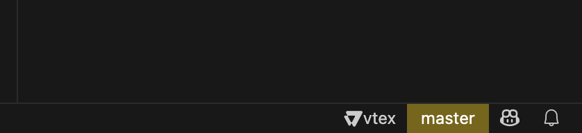
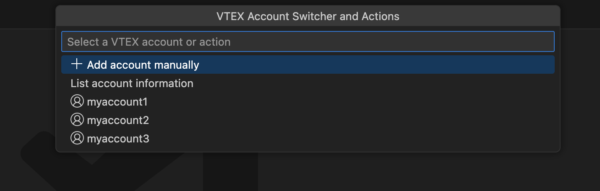
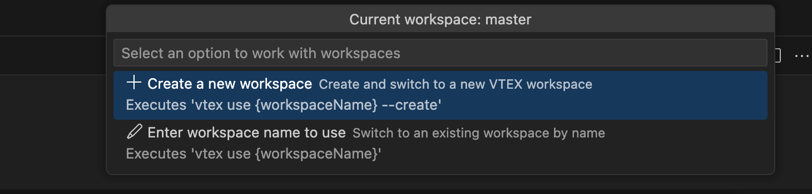

<h1 align="center">
   
    
   
  
  VTEX IO Utilities for Visual Studio Code
   
   
</h1>

### How do I use the extension?

You can open the Command Palette (`Ctrl+Shift+P`) and run the commands. The extension also adds a status bar item that shows your current VTEX account and workspace, which you can click to manage accounts and workspaces.

### What commands are available?

- **Create a VTEX IO diagram**: Create a diagram of your VTEX IO app in the current workspace or the selected directory using the contextual menu in the editor.
- **Show VTEX Account Info**: Display current VTEX account information in the status bar.
- **Switch VTEX Account**: Change between available VTEX accounts or add a new account manually.
- **Switch VTEX Workspace**: Change, create, or delete VTEX workspaces for the current account.

### Commands description

- **Create a VTEX IO diagram**: This command will create a diagram of your VTEX IO app dependencies in the current workspace or the selected folder, to generate the diagram the extension read the `manifest.json` file in the main folders only

This command helps you to visualize the dependencies of your VTEX IO app in a diagram, you can see the dependencies between the apps and the blocks.

### Contextual menu

You can use the contextual menu in the editor to run the next commands:

- **Create a VTEX IO diagram**: Create a diagram of your VTEX IO app in the current workspace or the selected directory.
- **Copy install VTEX apps command** and **Copy deploy VTEX apps command**: This commands allows you to select directories or use the current workspace to generate a list of apps to install based on the current version specified in the `manifest.json` file. It then copies the install command to the clipboard for easy pasting and execution in your terminal.

### VTEX Account and Workspace Management

The extension provides an integrated experience for managing your VTEX accounts and workspaces directly from VS Code:

#### Status Bar Integration

- **Account and Workspace Display**: The status bar shows your current VTEX account and workspace for quick reference.
- **Cached Information**: The extension maintains a cache of your workspaces per account to improve performance.

#### Account Management

Click on the account name in the status bar to:

- Switch between existing VTEX accounts
- Add a new account manually
- View account information via the VTEX CLI

#### Workspace Management

Click on the workspace name in the status bar to:

- View all workspaces for the current account with clear visual indicators for:
  - Current workspace (✓)
  - Production workspaces
- Switch to a different workspace
- Create a new workspace
- Delete unused workspaces
- Refresh the workspace list from VTEX CLI when needed

#### Caching

- The extension caches workspace information per account for faster access.
- When viewing from cache, an indicator appears in the workspace selection menu.
- You can manually refresh the cache by selecting the "Refresh workspaces" option.
- The cache updates automatically when you:
  - Switch to a different workspace
  - Create a new workspace
  - Delete a workspace

#### File Monitoring

The extension monitors changes to VTEX configuration files, ensuring that your status bar always displays the current account and workspace, even when they are changed externally through the VTEX CLI.

### How to install the extension?

You can install the extension from the [Visual Studio Code Marketplace](https://marketplace.visualstudio.com/items?itemName=MaikRestrepo.vtex-io-utilities-vscode)

### Screenshots

#### Status Bar with VTEX Account and Workspace

<!-- Suggestion: Add a screenshot showing the status bar with VTEX account and workspace indicators -->

#### Account Switching Menu

<!-- Suggestion: Add a screenshot showing the account QuickPick menu -->

#### Workspace Management

<!-- Suggestion: Add a screenshot showing the workspace QuickPick menu with active workspace, production indicators, and refresh/create/delete options -->

